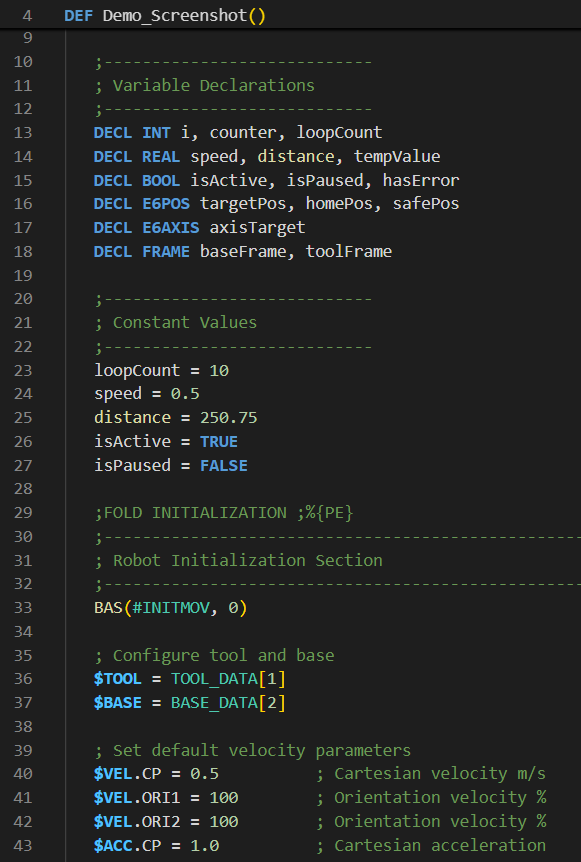
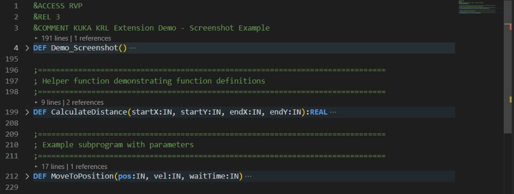
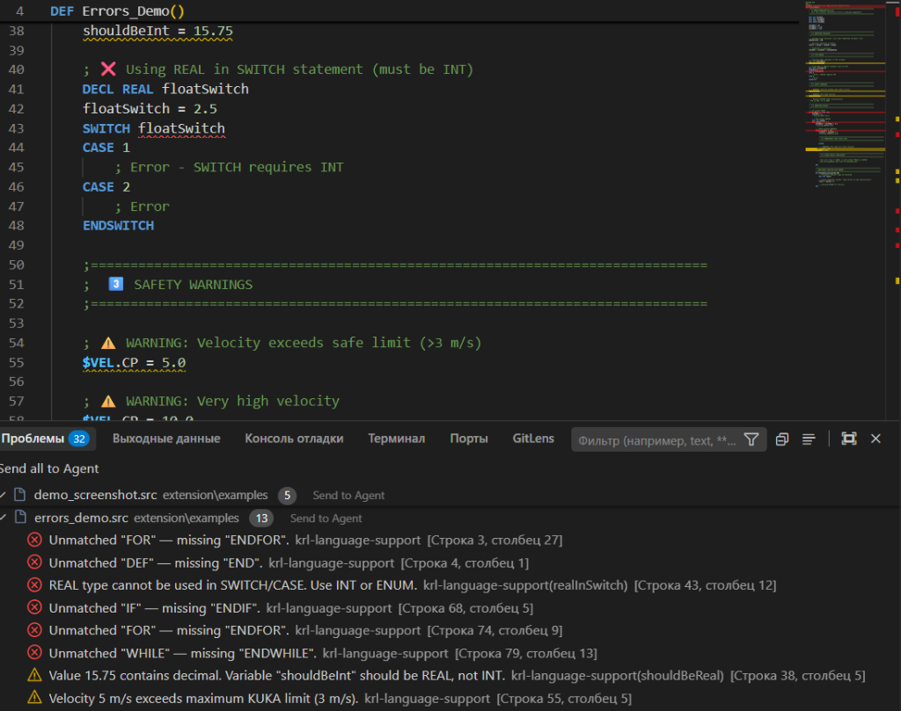
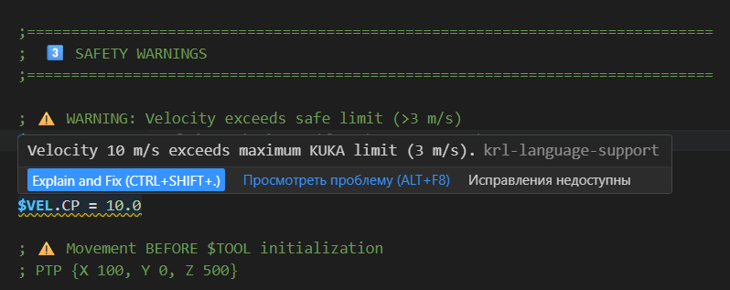
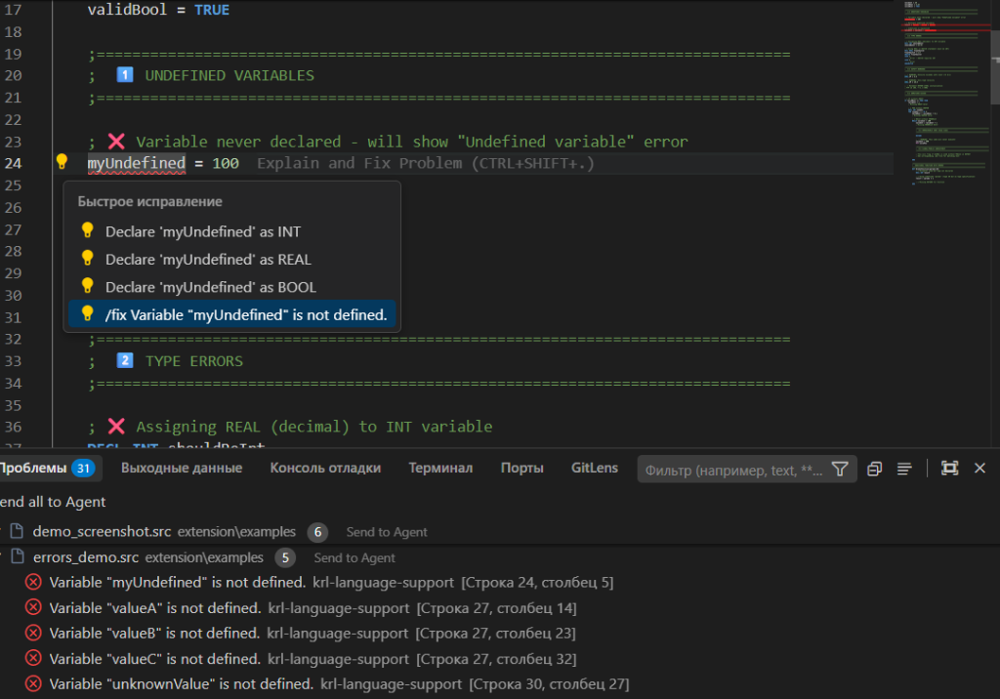
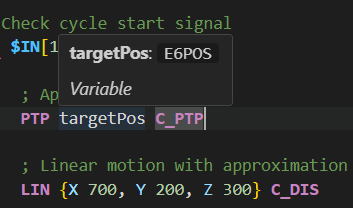
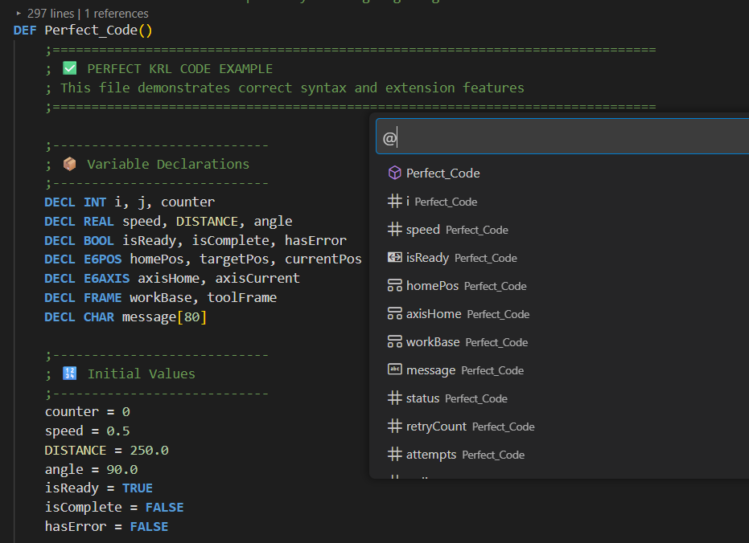
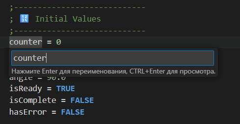
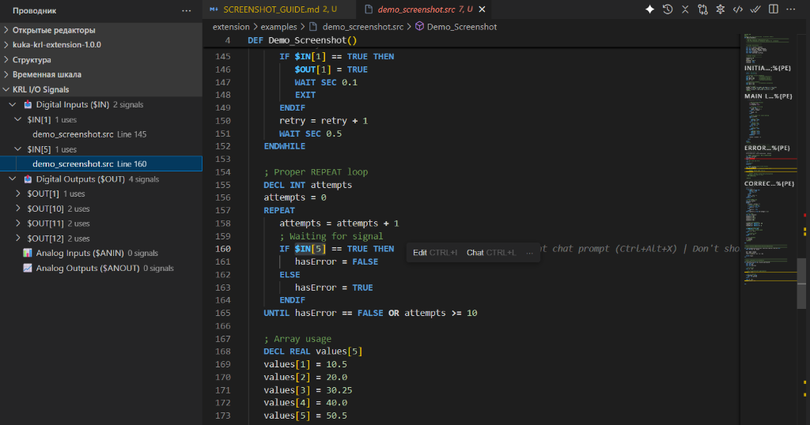

# KUKA KRL Extension

  

  <strong>Professional language support for KUKA Robot Language (KRL) in Visual Studio Code</strong>

  <a href="#english">English</a> •
  <a href="#русский">Русский</a> •
  <a href="#türkçe">Türkçe</a>

---

## English

### Overview

**KUKA KRL Extension** provides comprehensive language support for KUKA Robot Language (KRL) files (`.src`, `.dat`, `.sub`) in Visual Studio Code. Designed by robot programmers for robot programmers.

### Features at a Glance

  

<em>Full syntax highlighting with FOLD regions, system variables, and data types</em>

---

#### 🎨 Syntax Highlighting

Full syntax highlighting for all KRL constructs including keywords, data types, system variables, and comments.

- **Keywords**: `DEF`, `END`, `IF`, `THEN`, `FOR`, `WHILE`, `SWITCH`, `CASE`
- **Data types**: `INT`, `REAL`, `BOOL`, `CHAR`, `E6POS`, `E6AXIS`, `FRAME`
- **System variables**: `$TOOL`, `$BASE`, `$VEL.CP`, `$AXIS_ACT`
- **FOLD regions**: `;FOLD ... ;ENDFOLD` with icons

  

<em>CodeLens shows line count and references for each function</em>

---

#### 📦 Code Folding

Native support for `;FOLD ... ;ENDFOLD` regions with automatic folding on file open.

- **Fold All** — collapse all regions
- **Unfold All** — expand all regions  
- **Insert FOLD Region** — quickly wrap selected code
- **CodeLens** — shows number of lines and references above each function

---

#### ✅ Real-time Diagnostics

Instant error detection while you type:

  

<em>Problems panel showing errors and warnings with detailed descriptions</em>

| Category | Examples |
|----------|----------|
| **Undefined variables** | Highlights undeclared identifiers |
| **Unmatched blocks** | `IF` without `ENDIF`, `FOR` without `ENDFOR` |
| **Type errors** | `REAL` in `SWITCH/CASE`, decimal in `INT` variable |
| **Safety checks** | `$VEL.CP > 3 m/s`, `$TOOL/$BASE` not initialized |
| **Dead code** | Unreachable code after `RETURN/EXIT/GOTO` |

  

<em>Type error detection: decimal value assigned to INT variable</em>

  

<em>Safety warning: velocity exceeds maximum KUKA limit (3 m/s)</em>

---

#### 🔧 Quick Fixes

One-click solutions for common issues:

  

<em>Quick Fix menu: declare undefined variable as INT, REAL, or BOOL</em>

- Declare undefined variable as `INT`, `REAL`, or `BOOL`
- Add or remove `GLOBAL` keyword
- Change variable type (`INT` ↔ `REAL`)
- Wrap value with `ROUND()` for INT conversion
- Wrap code with `;FOLD` region

---

#### 💡 IntelliSense

Smart code completion for:

  

<em>Hover shows variable type and category</em>

- All KRL keywords and data types
- User-defined functions and variables
- KSS 8.7 system variables (`$AXIS_ACT`, `$POS_ACT`, etc.)
- Struct member access

---

#### 📍 Navigation

  

<em>Symbol navigation with @ prefix shows all file symbols with type icons</em>

| Feature | Shortcut | Description |
|---------|----------|-------------|
| Go to Definition | `F12` | Jump to function/variable declaration |
| Find All References | `Shift+F12` | Locate all usages |
| Document Symbols | `Ctrl+Shift+O` | Outline view of current file |
| Workspace Symbols | `Ctrl+T` | Search across all project files |

---

#### ✏️ Refactoring

  

<em>Rename symbol with preview support</em>

- **Rename Symbol** (`F2`) — rename across all files
- **Format Document** — standardize indentation
- **Remove Trailing Whitespace** — clean up code
- **Sort Declarations** — organize by type (INT, REAL, BOOL, FRAME, etc.)

---

#### 📊 I/O Signal Tree View

  

<em>I/O Signals sidebar: digital/analog inputs and outputs with usage count</em>

New sidebar panel showing all digital and analog I/O signals used in your project:

- `$IN[n]` / `$OUT[n]` — digital inputs/outputs
- `$ANIN[n]` / `$ANOUT[n]` — analog signals
- Click to navigate to usage location
- Shows number of uses for each signal

---

#### 🎨 WorkVisual Theme

5 included color themes:

- **KUKA WorkVisual** — light theme matching KUKA WorkVisual IDE
- **KUKA WorkVisual Dark** — dark version with KUKA orange accents
- **KRL Modern Dark** — modern GitHub Dark style
- **KRL High Contrast** — for bright environments
- **KRL Monokai** — classic Monokai adaptation

---

#### 🤖 KRC Project Tree View

Hierarchical view of your KUKA project structure:

- KRC / R1 robot folders
- Program, System, MADA directories
- Grouped by file type (.src / .dat / .sub)

---

#### 🔍 Find System Variables

`Ctrl+Shift+P` → `KRL: Find System Variables`

Quick Pick search for all `$`-prefixed variables in workspace with navigation.

---

### Installation

1. Download `.vsix` from [Releases](https://github.com/SilvestrLiskin/kuka-krl-extension/releases)
2. In VS Code: `Extensions` → `...` → `Install from VSIX...`
3. Select the downloaded file

### Supported File Types

| Extension | Description |
|-----------|-------------|
| `.src` | KRL source files |
| `.dat` | Data files (DEFDAT) |
| `.sub` | Subprogram files |

---

## Русский

### Обзор

**KUKA KRL Extension** — профессиональная поддержка языка KUKA Robot Language (KRL) для файлов `.src`, `.dat`, `.sub` в Visual Studio Code. Создано программистами роботов для программистов роботов.

### Возможности

#### 🎨 Подсветка синтаксиса

Полная подсветка всех конструкций KRL: ключевые слова, типы данных, системные переменные, комментарии.

  

<em>Подсветка синтаксиса с FOLD-регионами, системными переменными и типами данных</em>

---

#### 📦 Сворачивание кода

Встроенная поддержка регионов `;FOLD ... ;ENDFOLD` с автоматическим сворачиванием при открытии файла.

- **Свернуть всё** — сворачивает все регионы
- **Развернуть всё** — разворачивает все регионы
- **Вставить FOLD-регион** — быстро обернуть выделенный код
- **CodeLens** — показывает количество строк и ссылок над функциями

  

<em>CodeLens показывает количество строк и ссылок для каждой функции</em>

---

#### ✅ Диагностика в реальном времени

Мгновенное обнаружение ошибок:

  

<em>Панель "Проблемы" с ошибками и предупреждениями</em>

| Категория | Примеры |
|-----------|---------|
| **Неопределённые переменные** | Подсвечивает необъявленные идентификаторы |
| **Незакрытые блоки** | `IF` без `ENDIF`, `FOR` без `ENDFOR` |
| **Ошибки типов** | `REAL` в `SWITCH/CASE`, дробные числа в `INT` |
| **Проверки безопасности** | `$VEL.CP > 3 м/с`, `$TOOL/$BASE` не инициализированы |
| **Недостижимый код** | Код после `RETURN/EXIT/GOTO` |

  

<em>Предупреждение: скорость превышает лимит KUKA (3 м/с)</em>

---

#### 🔧 Быстрые исправления

Решение проблем одним кликом:

  

<em>Меню быстрого исправления: объявить переменную как INT, REAL или BOOL</em>

- Объявить переменную как `INT`, `REAL` или `BOOL`
- Добавить или удалить ключевое слово `GLOBAL`
- Изменить тип переменной (`INT` ↔ `REAL`)
- Обернуть значение в `ROUND()`
- Обернуть код в `;FOLD` регион

---

#### 💡 IntelliSense

Умное автодополнение:

  

<em>При наведении показывается тип переменной</em>

- Все ключевые слова и типы данных KRL
- Пользовательские функции и переменные
- Системные переменные KSS 8.7 (`$AXIS_ACT`, `$POS_ACT` и др.)
- Доступ к полям структур

---

#### 📍 Навигация

  

<em>Навигация по символам с иконками типов</em>

| Функция | Сочетание | Описание |
|---------|-----------|----------|
| Перейти к определению | `F12` | Переход к объявлению функции/переменной |
| Найти все ссылки | `Shift+F12` | Поиск всех использований |
| Символы документа | `Ctrl+Shift+O` | Структура текущего файла |
| Символы рабочей области | `Ctrl+T` | Поиск по всем файлам проекта |

---

#### ✏️ Рефакторинг

  

<em>Переименование символа с предпросмотром</em>

- **Переименовать символ** (`F2`) — переименование во всех файлах
- **Форматировать документ** — стандартизация отступов
- **Удалить пробелы в конце строк** — очистка кода
- **Сортировать объявления** — упорядочить по типу

---

#### 📊 Панель I/O сигналов

  

<em>Боковая панель I/O сигналов с количеством использований</em>

Новая боковая панель, показывающая все цифровые и аналоговые I/O сигналы проекта:

- `$IN[n]` / `$OUT[n]` — цифровые входы/выходы
- `$ANIN[n]` / `$ANOUT[n]` — аналоговые сигналы
- Клик для перехода к месту использования
- Показывает количество использований каждого сигнала

---

#### 🎨 Темы оформления

5 встроенных цветовых тем:

- **KUKA WorkVisual** — светлая тема в стиле KUKA WorkVisual IDE
- **KUKA WorkVisual Dark** — тёмная версия с оранжевыми акцентами KUKA
- **KRL Modern Dark** — современный стиль GitHub Dark
- **KRL High Contrast** — для ярких помещений
- **KRL Monokai** — классическая адаптация Monokai

---

### Установка

1. Скачайте `.vsix` из [Releases](https://github.com/SilvestrLiskin/kuka-krl-extension/releases)
2. В VS Code: `Extensions` → `...` → `Install from VSIX...`
3. Выберите загруженный файл

---

## Türkçe

### Genel Bakış

**KUKA KRL Extension** — Visual Studio Code'da KUKA Robot Dili (KRL) dosyaları (`.src`, `.dat`, `.sub`) için profesyonel dil desteği. Robot programcıları tarafından robot programcıları için tasarlandı.

### Özellikler

#### 🎨 Sözdizimi Vurgulama

Tüm KRL yapıları için tam sözdizimi vurgulama: anahtar kelimeler, veri türleri, sistem değişkenleri, yorumlar.

  

---

#### 📦 Kod Katlama

`;FOLD ... ;ENDFOLD` bölgeleri için yerel destek ve dosya açıldığında otomatik katlama.

- **Tümünü Katla** — tüm bölgeleri katla
- **Tümünü Aç** — tüm bölgeleri aç
- **FOLD Bölgesi Ekle** — seçili kodu hızlıca sar
- **CodeLens** — her fonksiyonun üzerinde satır sayısı ve referansları gösterir

---

#### ✅ Gerçek Zamanlı Tanılama

Yazarken anında hata tespiti:

  

| Kategori | Örnekler |
|----------|----------|
| **Tanımsız değişkenler** | Bildirilmemiş tanımlayıcıları vurgular |
| **Eşleşmeyen bloklar** | `ENDIF` olmadan `IF`, `ENDFOR` olmadan `FOR` |
| **Tür hataları** | `SWITCH/CASE` içinde `REAL`, `INT` değişkende ondalık |
| **Güvenlik kontrolleri** | `$VEL.CP > 3 m/s`, `$TOOL/$BASE` başlatılmamış |

---

#### 🔧 Hızlı Düzeltmeler

  

Tek tıklamayla sorun çözümleri:

- Değişkeni `INT`, `REAL` veya `BOOL` olarak tanımla
- `GLOBAL` anahtar kelimesini ekle veya kaldır
- Değişken türünü değiştir (`INT` ↔ `REAL`)
- Kodu `;FOLD` bölgesiyle sar

---

#### 💡 IntelliSense

  

Akıllı kod tamamlama:

- Tüm KRL anahtar kelimeleri ve veri türleri
- Kullanıcı tanımlı fonksiyonlar ve değişkenler
- KSS 8.7 sistem değişkenleri (`$AXIS_ACT`, `$POS_ACT`, vb.)
- Yapı üye erişimi

---

#### 📍 Gezinme

  

| Özellik | Kısayol | Açıklama |
|---------|---------|----------|
| Tanıma Git | `F12` | Fonksiyon/değişken bildirimine atla |
| Tüm Referansları Bul | `Shift+F12` | Tüm kullanımları bul |
| Belge Sembolleri | `Ctrl+Shift+O` | Mevcut dosyanın ana hatları |
| Çalışma Alanı Sembolleri | `Ctrl+T` | Tüm proje dosyalarında ara |

---

#### ✏️ Yeniden Düzenleme

  

- **Sembolü Yeniden Adlandır** (`F2`) — tüm dosyalarda yeniden adlandır
- **Belgeyi Biçimlendir** — girintileri standartlaştır
- **Sondaki Boşlukları Kaldır** — kodu temizle
- **Bildirimleri Sırala** — türe göre düzenle

---

#### 📊 I/O Sinyal Ağacı

  

Projedeki tüm dijital ve analog I/O sinyallerini gösteren yeni kenar çubuğu paneli.

---

#### 🎨 WorkVisual Teması

KUKA WorkVisual IDE renklerine uygun 5 tema dahildir.

---

### Kurulum

1. `.vsix` dosyasını [Releases](https://github.com/SilvestrLiskin/kuka-krl-extension/releases) sayfasından indirin
2. VS Code'da: `Extensions` → `...` → `Install from VSIX...`
3. İndirilen dosyayı seçin

---

## License

MIT License — see [LICENSE](LICENSE.txt) for details.

## Author

**Liskin Labs**  
📧 <silvlis@outlook.com>  
🔗 [github.com/SilvestrLiskin](https://github.com/SilvestrLiskin)

---

  Made with ❤️ for the robotics community

